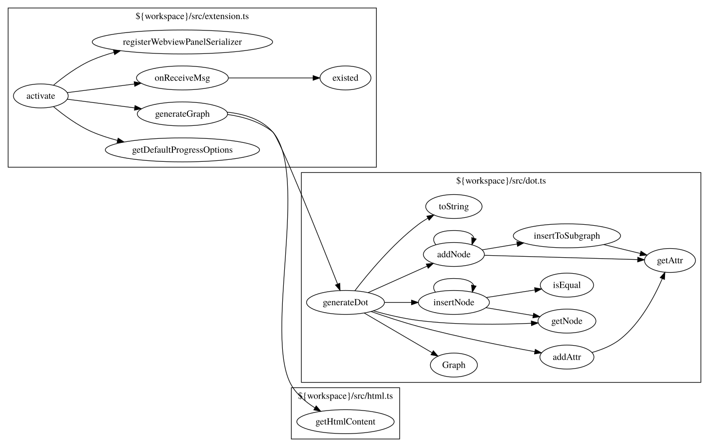

# call-graph

vscode extension for generate call graph in [graphviz dot language](https://www.graphviz.org/doc/info/lang.html), based on vscode call hierarchy language feature.

## Features

* generate call graph in graphviz dot language and preview.
* save graph as dot or svg file

## Quick start
1. Open your folder and select a entry function
2. Run `CallGraph.showOutgoingCallGraph` command using context menu or `Ctrl+Shift+P` to show outgoing calls
3. Or Run `CallGraph.showIncomingCallGraph` command using context menu or `Ctrl+Shift+P` to show incoming calls
4. Click `save dot file` or `save as svg` in the bottom left corner to save the graph
5. Add `.callgraphignore` file in your project root directory to ignore some files or folders in workspace (the syntax is the same as `.gitignore`)

## Configuration
You can configure `ignoreFile`(.callgraphignore by default), `maxDepth` and `saveDir` for svg or dot in settings. See the descriptions in setting.

## How it works
It depends `vscode.provideOutgoingCalls` and `vscode.provideIncomingCalls` built-in commands( the same with `Show Call Hierarchy` command, not available for some language server ).

## For more information
* Also developed by me for preview and edit graphviz file:
  - [Graphviz Viewer Online](https://graphviz.net)
  - [Graphviz Viewer in Google Play](https://play.google.com/store/apps/details?id=indie.haozi.gvviewer)
* [GitHub](https://github.com/beicause/call-graph)

## Donate
[Donate me via Paypal](https://paypal.me/beicause). Thank you for you support to this project and my open source works.

**Enjoy!**
